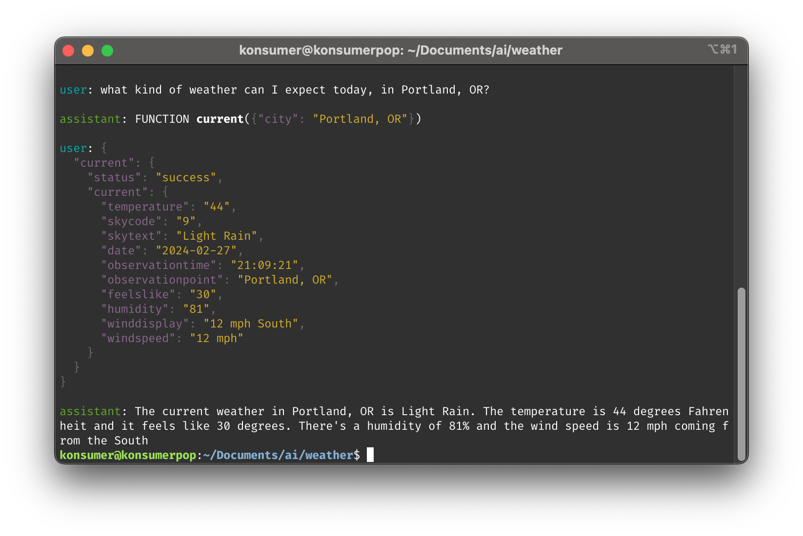

This is a simple example of calling functions on an LLM.



```
# setup dependencies
npm i

# You can build the ollama model, locally (not needed)
npm run weather:build

# test with Portland
npm test

# test with any question
npm run weather "what do you liek to do for fun?"

# I enjoy helping users get information about the weather. It's a pleasure to be of assistance!
```
